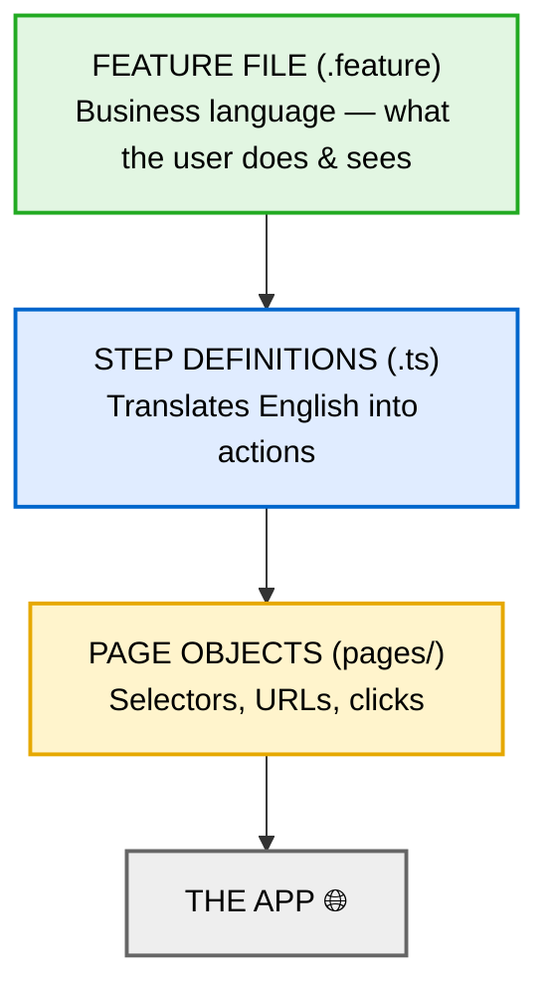

# Writing Good Gherkin 🥒

A short guide to `Given`, `When`, `Then`, `And`.

> **Golden rule:** Gherkin describes **what a user experiences**, never **how the code does it**.
> If a step mentions an HREF, a CSS class, or a click coordinate, it's in the wrong file.

---

## The keywords

| Keyword | Means | Think of it as |
| --- | --- | --- |
| **Given** | The starting situation, already true before the test acts. | *"The world is set up like this."* |
| **When** | The one action the user takes. | *"The user does this."* |
| **Then** | The outcome the user can see. | *"So they see this."* |
| **And** | Continues whatever keyword came before it. | *"...and also."* |

```gherkin
Given I am on the NBS Source homepage
And I have closed the cookie popup
When I search for "dyson"
Then I should see Dyson in the manufacturer results
```

`And` after `Given` is still a Given. `And` after `Then` is still a Then. It only exists so the
scenario reads like English instead of `Given / Given / Given`.

---

## One rule per keyword 📏

- **Given** — past/already-true. No actions the user is "testing". Usually 1–2 steps.
- **When** — **one** action. Two `When`s usually means two scenarios.
- **Then** — an observable result, not a technical check. No new actions.

---

## What Gherkin should NOT contain 🙅

| Don't | Why | Instead |
| --- | --- | --- |
| Selectors — `.btn-primary`, `#nav > li:nth-child(2)` | Meaningless to a human; breaks on redesign. | Hide it in the page object. |
| Technical vocabulary — *"the HREF attribute is `tel:08003457788`"* | Users don't know what an HREF is. | *"the phone number links to Dyson's sales line"* |
| UI mechanics — *"I click the third tab"* | Describes the how, not the goal. | *"I open the Products tab"* |
| Test-code words — *"assert"*, *"verify"*, *"check"* | `Then` already means "check". | *"the heading should show Dyson"* |
| A whole journey in one step — *"I click the button and it behaves as expected"* | Hides the behaviour; unreadable when it fails. | Split into When + Then. |
| Conditionals — *"if logged in, then..."* | A scenario has one path. | Two scenarios. |

---

## Naming scenarios 🏷️

The name says **the behaviour**, not the activity of testing it.

| ❌ | ✅ |
| --- | --- |
| `Assert that the dyson telephone number is correct` | `Visitors can call Dyson from the manufacturer page` |
| `Check the "I'm a manufacturer" button is visible with the right text and link` | `Manufacturers are invited to join NBS Source` |

---

## Before & after 🔁

Real steps from `features/dyson-manufacturer-page.feature`:

```gherkin
# ❌ Technical — describes the DOM
Scenario: Assert the LinkedIn icon is visible and has the expected href
  Then Ensure the HREF attribute on the LinkedIn icon is as expected "https://www.linkedin.com/company/dyson/"
```

```gherkin
# ✅ Behavioural — describes the user
Scenario: Visitors can reach Dyson's LinkedIn page
  When I select the LinkedIn icon
  Then I should be taken to Dyson's LinkedIn profile
```

The URL didn't disappear — it moved into the step definition, where it belongs.

---

## The layers 🍰



Technical detail sinks to the bottom. If it's leaked into the top layer, move it down.

---

## Background 🧱

`Background` runs before every scenario in the file — use it for shared **setup only**.

- ✅ `Given I am on the Dyson manufacturer page`
- ❌ Anything with a `Then` in it. A `Then` in `Background` means you're testing in your setup.

> ⚠️ Our current Dyson `Background` ends with `Then I should be on the Dyson manufacturer page`.
> That assertion belongs in its own scenario.

---

## The checklist ✅

Before you commit a `.feature` file:

1. Could a **non-technical colleague** read it and understand the feature?
2. Is there **no** selector, URL, or HREF anywhere in it?
3. Does each scenario test **one** behaviour?
4. Does each `When` have a matching `Then`?
5. Does the scenario name describe **behaviour**, not "assert X"?
